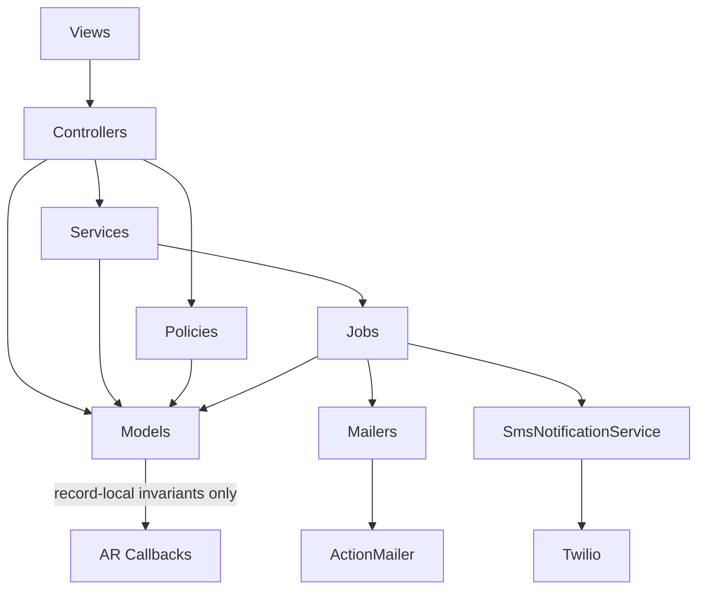
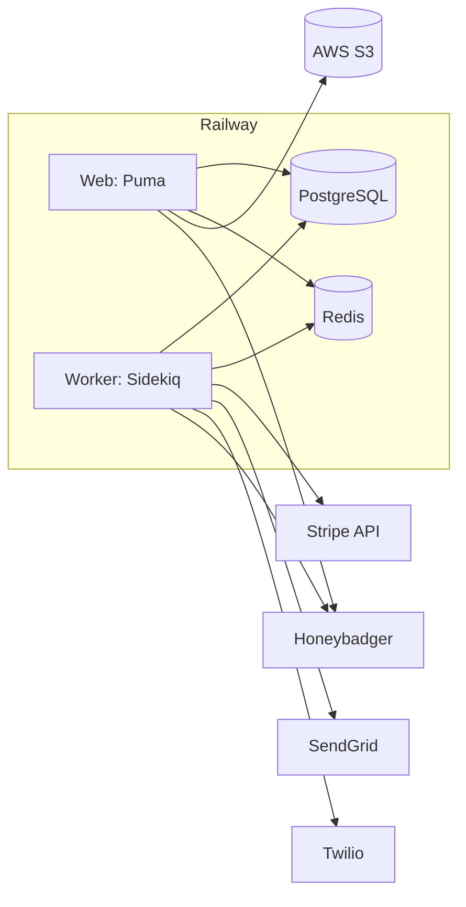
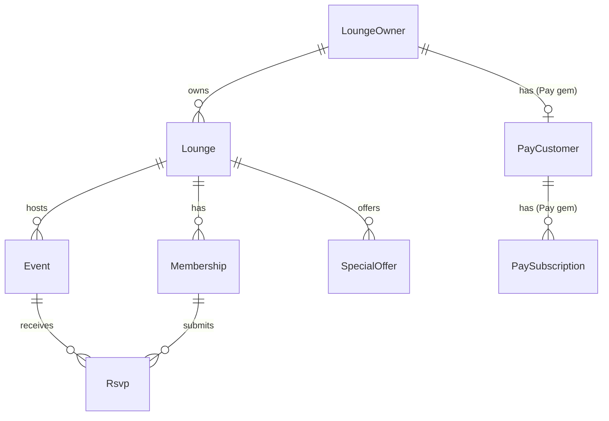

# Architecture Spine — herf_app_mvp_2025_v1

## Design Paradigm

Rails MVC monolith. Record-local invariants (validations, token generation, scoping) stay in ActiveRecord models. Cross-cutting concerns — anything a second independently-built feature could implement a different way — move to a dedicated object type the controller calls explicitly:

- `app/services/` — orchestration with side effects (notifications, cross-model writes)
- `app/policies/` — Pundit authorization policies
- `app/policies/` (or `app/models/plan_limit_policy.rb`) — plan-limit enforcement

ActiveRecord callbacks (`after_create`, `after_update`, etc.) are reserved for invariants a record must keep true about itself, never for triggering effects on other parts of the system.

## Invariants & Rules

### AD-1 — Cross-cutting side effects are explicit, not callback-driven, through one entrypoint per entity

- **Binds:** all new features with side effects beyond the record itself (notifications, billing, cross-model writes)
- **Prevents:** new hidden callback chains (the existing Event/SpecialOffer callback-driven notifications are legacy shape, not the template); also prevents two independent creators of the same entity applying different side effects — e.g. today's `MembershipsController#create` (fires a welcome mailer) vs. `AdminDashboardController#member_upload` (creates `Membership` rows directly, no mailer) already diverge this way
- **Rule:** a controller or job calls an explicit service object to trigger a side effect; `after_create`/`after_update`/`after_destroy` callbacks may only enforce invariants local to that record (token generation, timestamps, derived attributes). Each side-effect-bearing entity has exactly one designated creation/mutation service; any alternate creation path (bulk import, admin tool) must call that same service, never duplicate or skip its effects.

### AD-2 — Plan-limit enforcement is centralized

- **Binds:** any resource capped by subscription plan (currently Membership, Event, SpecialOffer)
- **Prevents:** a fourth near-duplicate `*_limit_not_exceeded` validation method, and plan-limit logic drifting out of sync across models when a plan changes
- **Rule:** all plan-limit checks call a single `PlanLimitPolicy` (or equivalently-named policy object) that takes the owner and resource type and returns pass/fail. `PlanLimitPolicy` owns count computation itself (callers never pre-count and pass a count in); each resource type declares its own period (total-lifetime for Membership, monthly for Event/SpecialOffer) as data the policy reads, not logic a caller replicates. The policy is invoked from exactly one layer — the model validation — so a bulk/`save(validate: false)` path cannot bypass it silently; a bulk creator that needs to skip validations must call the policy explicitly itself.

### AD-3 — One lounge per owner is the fixed invariant

- **Binds:** all lounge-owner-facing features
- **Prevents:** some features assuming `lounge_owner.lounges.first` is "the" lounge while others iterate all lounges — the current half-supported multi-lounge shape
- **Rule:** code may rely on a lounge owner having exactly one active lounge. The canonical accessor is `lounge_owner.lounge` (single, not `.lounges.first`); a DB-level unique constraint on `lounges.lounge_owner_id` enforces it so two independently-built creation paths (e.g. onboarding vs. a future "duplicate for new season" feature) can't race into two rows. Introducing real multi-lounge support is a deliberate, spine-level migration (see Deferred), never an incidental side effect of a feature PR.

### AD-4 — Authorization goes through Pundit policies

- **Binds:** all new controller actions requiring authorization beyond `authenticate_lounge_owner!`
- **Prevents:** a silently-missing check like the current disabled `authenticate_admin!` (AGENTS.md pitfall) — ad hoc checks are easy to forget and impossible to verify by inspection
- **Rule:** a new authorized action defines or reuses a Pundit policy (`app/policies/`) and calls `authorize`/`policy_scope`; a bare `before_action` custom-checking ownership (e.g. today's `find_event_and_authorize`) is not an acceptable pattern for new controllers. A policy class is written against exactly one identity type (`LoungeOwner` or `Admin`, per AD-5) — never a shared "generic user" interface assumed to fit both.

### AD-5 — Identity models never merge [ADOPTED]

- **Binds:** `LoungeOwner`, `Admin`
- **Prevents:** platform-operator identity and paying-customer identity sharing a table/session, which would blur the trust boundary between the two
- **Rule:** `LoungeOwner` and `Admin` remain separate Devise models with separate session scopes, permanently.

### AD-6 — Members are authenticated by token only [ADOPTED]

- **Binds:** `Membership`, `Rsvp`, any future member-facing (non-owner) endpoint
- **Prevents:** introducing a login/session path for members, which would duplicate the owner auth system for a user type that is deliberately login-less
- **Rule:** all member-facing actions are authorized solely by possession of a secure random token (e.g. `Rsvp#rsvp_token`) passed in the URL; never a session or password.

### AD-7 — Pay gem tables are the sole subscription-state authority [ADOPTED]

- **Binds:** subscription/billing status anywhere in the app
- **Prevents:** a cached or duplicated "is subscribed" flag — or a derived stand-in like a `grace_period_ends_at` column — drifting from the real Stripe-backed state and becoming a second, silently-diverging authority
- **Rule:** subscription status is always read live via `lounge_owner.subscribed?` (backed by `pay_subscriptions`/`pay_customers`); no other table or column may store subscription status or any derived field that functions as one.

### AD-8 — All outbound communication is always asynchronous [ADOPTED]

- **Binds:** all email and SMS the app sends, to members or owners — not members alone, closing the loophole where an owner-facing alert could still be sent synchronously and letter-comply
- **Prevents:** a request thread blocking on SendGrid/Twilio calls, and job-processing guarantees (retry, backoff) being silently bypassed
- **Rule:** every outbound email or SMS is enqueued via ActiveJob (`deliver_later` / `*Job.perform_later`) onto Sidekiq; no controller, model, or service ever calls a mailer's `deliver_now` or the Twilio client directly in the request cycle.

### Dependency Direction



## Consistency Conventions

| Concern | Convention |
| --- | --- |
| Naming (entities, files, interfaces, events) | Standard Rails naming; jobs suffixed `*NotificationJob`/`*ReminderJob`, mailers suffixed `*Mailer`, policies suffixed `*Policy` |
| Data & formats (ids, dates, error shapes, envelopes) | All primary keys are UUIDs; all times rendered/compared in `Eastern Time (US & Canada)` (`config.time_zone`); money is always a Stripe-side amount (cents), never a local decimal/float field; `Rsvp.status` is an integer enum |
| State & cross-cutting (mutation, errors, logging, config, auth) | Cross-cutting side effects via explicit services (AD-1); plan limits via `PlanLimitPolicy` (AD-2); authorization via Pundit (AD-4); errors captured centrally via Honeybadger; all outbound comms always async (AD-8) |
| Token issuance (member-facing secure links) | Follow `Rsvp#rsvp_token`'s existing shape: `SecureRandom`-generated, unique indexed column, explicit `expires_at` — any new token-authenticated feature reuses this shape rather than inventing its own entropy/expiry/field convention |

## Stack

| Name | Version |
| --- | --- |
| Ruby | 3.3.1 |
| Rails | 7.1.5.1 |
| PostgreSQL | 9.3+ (per `config/database.yml`; production version managed by Railway) |
| Sidekiq | 8.0.9 (pinned in Gemfile.lock — not 7.x) |
| sidekiq-cron | 2.3.1 |
| Redis | not version-pinned in the Gemfile; whatever Railway's managed Redis provides |
| Devise | 4.9.4 (pinned; upstream Devise 5.0.0 exists — not verified compatible, treat any upgrade as its own task) |
| Pay | 10.1.5 (pinned; upstream is now Pay 11.x — an intentional pin, not an oversight, but worth a deliberate upgrade evaluation someday) |
| Pundit | ~> 2.5 (verified current, 2.5.2 as of Sep 2025 on rubygems.org) — new dependency per AD-4 |
| sendgrid-actionmailer | 3.2.0 — **effectively unmaintained**: last release Feb 2021, maintainer opened an "intent to archive" issue Jan 2025. Load-bearing for AD-8. See Deferred. |
| twilio-ruby | 7.6.1 (pinned; upstream is newer, not verified compatible) |
| Honeybadger | 6.5.2 (pinned; upstream is newer, not verified compatible) |
| Ransack | 4.3.0 |
| Kaminari | 1.2.2 |
| RSpec-rails | 7.0.2 |
| FactoryBot-rails | 6.4.4 |
| Capybara | 3.40.0 |
| Shoulda-Matchers | 6.4.0 |
| Hotwire (Turbo + Stimulus) | Rails 7.1 default, via Import Maps (no Node/webpack) — still the current idiomatic choice for Rails 7.1, no supersession found |
| Tailwind CSS | via `tailwindcss-rails` |
| Active Storage + AWS S3 | production file storage |

## Structural Seed

### Deployment & Environments

Railway (Docker-based, per Dockerfile) hosts production. Two process types from `Procfile`: `web` (Puma) and `sidekiq` (worker). PostgreSQL and Redis are managed add-ons/services. `SIDEKIQ_SETUP.md`'s Heroku instructions are stale (AD confirmed: production is Railway) and should be corrected.



### Core Entities



### Source Tree

```text
app/
  controllers/   # thin; call policies/services, never business logic
  models/        # record-local invariants only (AD-1)
  services/      # cross-cutting orchestration (SmsNotificationService lives here; PlanLimitPolicy candidate location)
  policies/      # Pundit authorization policies (new, per AD-4)
  jobs/          # ActiveJob classes, Sidekiq-backed
  mailers/       # ActionMailer classes, always deliver_later (AD-8)
  javascript/controllers/   # Stimulus controllers
config/
  application.rb   # UUID PK generator, Eastern TZ, Sidekiq queue adapter
  sidekiq.yml, sidekiq_schedule.yml   # worker + cron config
spec/
  models/, controllers/, requests/, mailers/, jobs/, features/, services/, factories/, support/
```

## Deferred

- **`sendgrid-actionmailer` is effectively unmaintained** (last release Feb 2021; maintainer opened an "intent to archive" issue Jan 2025) despite being load-bearing for all production email (AD-8). Not an immediate break, but a real risk if it stops working with a future Rails/Ruby upgrade. Migration path when addressed: the official `sendgrid-ruby` client behind a custom `ActionMailer::Base.delivery_method`, or switching providers (Postmark, Mailgun). Not decided here — flagging so it doesn't get silently forgotten.
- **True multi-lounge support** — schema allows it, but AD-3 fixes single-lounge as the invariant for now; revisit only as a deliberate migration if a real multi-lounge need arises.
- **Internal shape of the new service/policy layer** (`app/services/`, `app/policies/` conventions beyond "exists and is called explicitly") — AD-1/AD-2/AD-4 fix *that* the boundary exists, not the internal class design; settle per-feature as the first services/policies are written.
- **CI pipeline** — none exists today (AGENTS.md notes rspec/RuboCop run locally only). Setting one up is tracked as a backlog item, not decided here; route to `bmad-testarch-ci` when ready.
- **Removal of `SubscriptionManagementController`** — the temporary token-gated subscription-grant tool (already flagged in AGENTS.md as a known pitfall); removal timing is the user's call, not fixed here.
- **JSON/API layer** — no general API exists beyond the one ad hoc admin JSON tool; not designed until a real need appears.
